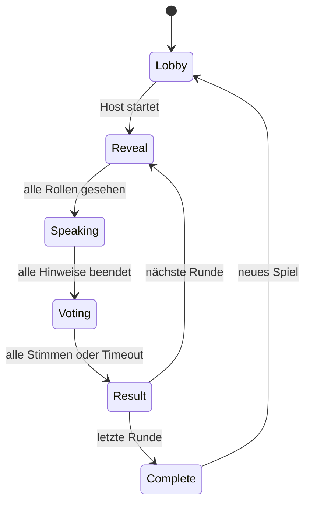

# Doppelwort – Architektur und Entscheidungen

## Entscheidung

Die bestehende Vinext-/React-Anwendung bleibt das Frontend. Die Spiellogik ist eine reine, deterministische Zustandsmaschine ohne Rendering-Abhängigkeit. Realtime und Persistenz liegen hinter einem Adapter.

Produktives Ziel:

- Supabase Postgres als autoritative Datenbank
- Supabase Realtime für Raum- und Spielereignisse
- PostgreSQL-Funktionen für atomare Zustandswechsel
- Row Level Security und kurzlebige Gast-Sessions
- Edge Functions für Moderation, Passwortprüfung, Rate Limits und geheime Rollenverteilung

Lokaler Integrationsmodus:

- versionierter `localStorage`-Snapshot
- `BroadcastChannel` für Synchronisierung zwischen Tabs desselben Browsers
- vollständiger Pass-and-Play-Ablauf für UI-, Engine- und E2E-Tests
- sichtbare Kennzeichnung; keine Behauptung geräteübergreifender Verbindung

## Spielfluss

## Sieglogik

Jede Person darf bis zu `imposter_count` Verdächtige auswählen oder überspringen. Ein Spieler gilt als erkannt, wenn ihn mehr als die Hälfte aller stimmberechtigten Spieler auswählt; Skip bleibt Teil der Mehrheitsbasis. Die Crew gewinnt genau dann, wenn:

1. jeder Imposter diese absolute Mehrheit erreicht und
2. kein Crewmitglied diese Mehrheit erreicht.

In allen anderen Fällen gewinnen die Imposter. Der Standard ist ein Imposter.

## Vertrauensgrenzen

- Der Browser darf niemals Rollen anderer Spieler oder das jeweils andere Wort erhalten.
- Start, Timerwechsel, Abstimmungsauswertung und Punkte sind serverautorisierte Befehle.
- Client-Ereignisse enthalten `action_id`, Gast-Session und erwartete Zustandsrevision gegen Replay und Rennen.
- Passwörter werden serverseitig mit Argon2id gehasht und niemals an Realtime-Abonnenten gesendet.
- Moderations- und Auditdaten sind nicht über die normale Raum-Subscription lesbar.

## Reconnect und Recovery

- Client-Heartbeat alle 15 Sekunden, offline nach 45 Sekunden.
- Reconnect mit exponentiellem Backoff und Zufallsanteil.
- Nach Reconnect wird immer ein autoritativer Snapshot geladen; verpasste Events werden nicht blind nachgespielt.
- Jede Spielmutation erhöht `revision` und ist idempotent über `action_id`.
- Hostwechsel erfolgt in einer kurzen Transaktion an den ältesten verbundenen Spieler.

## Deployment-Grenze

Die bestehende ChatGPT-Sites-Auslieferung kann das Frontend hosten, stellt aber in diesem Workspace keinen verbundenen Postgres-/Realtime-Dienst bereit. Geräteübergreifendes Multiplayer wird erst produktiv, wenn ein Supabase-Projekt angelegt und seine öffentlichen Clientvariablen sowie serverseitigen Secrets als Hosting-Umgebung gesetzt sind.
