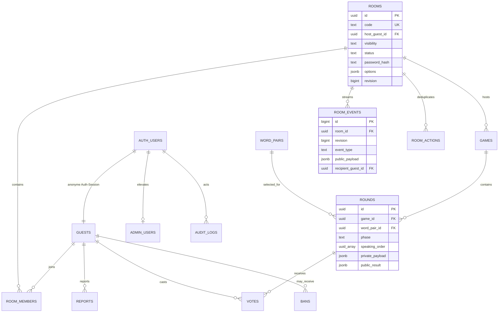

# Doppelwort – Datenmodell

`rounds.private_payload`, `votes`, `word_pairs` und Passwort-Hashes sind nicht direkt für Clients lesbar. Realtime veröffentlicht ausschließlich `room_events`; persönliche Rollen-/Wortereignisse tragen eine `recipient_guest_id` und werden durch RLS gefiltert.
